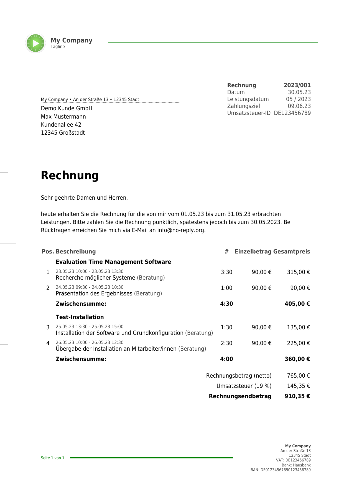

# Invoice Template: Grouped By Projects
This template is based on din5008-invoice. For my invoices, it is necessary to provide the client with a breakdown of individual projects and activities performed. It's not the prettiest loop I use for this, but it works ;-).



## Customization
The template creates an invoice in A4 format with the file name `YYYY-MM-DD_invoice-number_customer.pdf`. This can be customized in the first three lines.

Basic changes to the layout can be made in the following lines. The highlight color is applied to the header and footer lines. The suppress color is used by the template in various places.

```twig





```

If available, the logo specified under `System -> Settings -> My company` is used. The default logo to be used alternatively can be changed in line 14.

## Group-By feature
It is not quite easy to group by projects. My workaround is to iterate through a maximum number of projects. If more projects than this value are calculated in one invoice, the template turns off the grouping. The default value is 50, which should be more than sufficient. It can be changed in line 11: 

```twig

```

## Expenses and other positions
Anything that is not a timesheet entry is listed at the end of the list as expenses. This feature requires either the Expenses module or the use of the cloud variant of Kimai.
